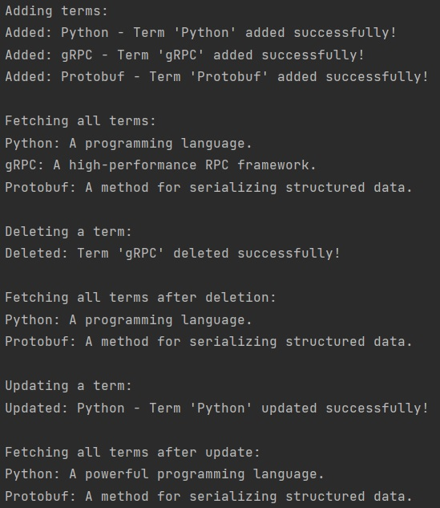
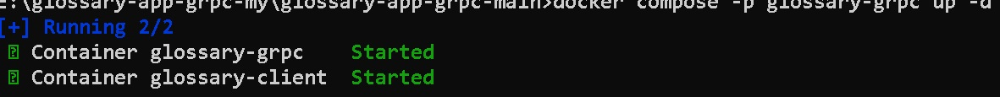
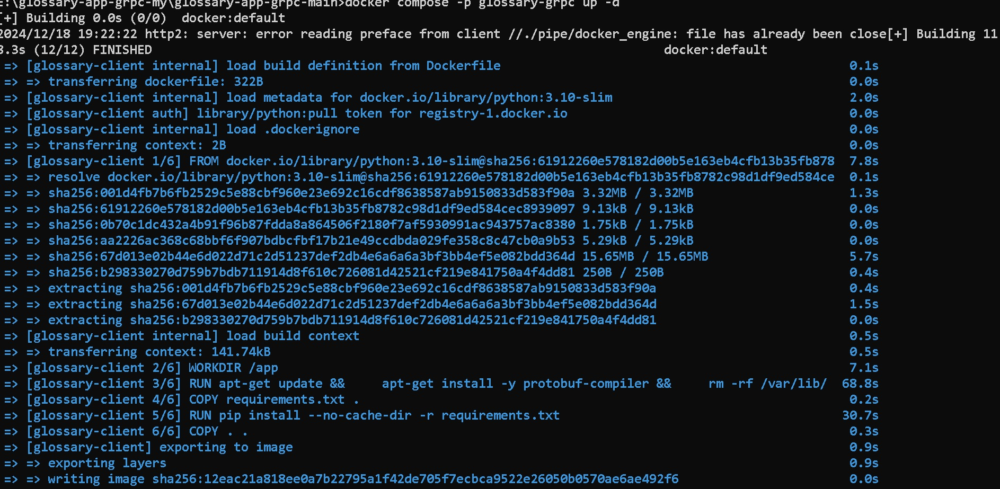
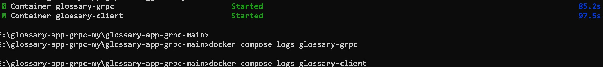
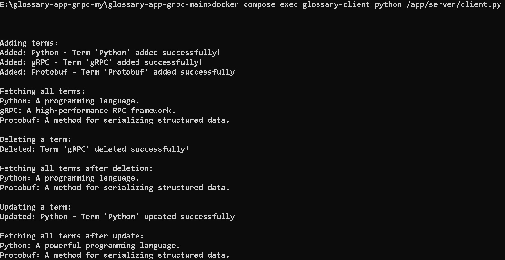

# Глоссарий на gRPC

Этот проект представляет собой gRPC для управления глоссарием с использованием gRPC и SQLite. 
В его функционал входят: добавление, изменение, удаление и получение терминов из глоссария.


## Работа приложения

### 1. Добавление термина

Запуск клиента для добавления термина:

```bash
python server/client.py
```

Пример добавления термина:

```python
stub.AddTerm(glossary_pb2.Term(keyword="Python", description="A programming language."))
```

### 2. Получение всех терминов

После добавления терминов можно получить список всех терминов:

```python
response = stub.GetAllTerms(glossary_pb2.Empty())
for term in response.terms:
    print(f"{term.keyword}: {term.description}")
```

### 3. Получение термина по ключевому слову

Для получения конкретного термина по ключевому слову используйте метод GetTerm:

```python
response = stub.GetTerm(glossary_pb2.Keyword(keyword="Python"))
print(f"{response.keyword}: {response.description}")
```

### 4. Обновление термина

Чтобы обновить существующий термин, отправьте запрос с новым описанием:

```python
response = stub.UpdateTerm(glossary_pb2.Term(keyword="Python", description="An interpreted programming language."))
```

### 5. Удаление термина

Для удаления термина по ключевому слову:

```python
response = stub.DeleteTerm(glossary_pb2.Keyword(keyword="Python"))
```

## Пример работы



3. Шаги для запуска через Docker

### 1. Сборка Docker-образов
Для сборки образов выполните:  

```bash
docker compose build
```
docker compose build
Эта команда создаст образы для сервера и клиента на основе Dockerfile и docker-compose.yml.

---

### 2. Запуск серверного и клиентского контейнеров
Для запуска всех сервисов выполните:  
```bash
docker compose up -d
```
- Флаг -d запускает контейнеры в фоновом режиме.
- Сервер будет доступен на порту 50051, указанном в конфигурации.




Чтобы проверить, что контейнеры запущены: 
```bash
docker compose ps
```
---

### 3. Запуск только сервера
Если требуется запустить только сервер, выполните:  
```bash
docker compose up -d glossary-grpc
```

---

### 4. Проверка логов
Если вы хотите посмотреть логи конкретного контейнера:  
- Для сервера:  
 ```bash
  docker compose logs glossary-grpc
```
  
- Для клиента:  
 
 ```bash
  docker compose logs client
```

  

### 5. Запуск клиента через Docker
Чтобы запустить клиентский скрипт client.py, используйте команду:
 ```bash
docker compose exec glossary-client python /app/server/client.py
```

Расшифровка команды:

- docker compose exec — выполняет команду внутри запущенного контейнера.
- glossary-client — имя сервиса клиента из вашего docker-compose.yml.
- python /app/server/client.py — запускает клиентский файл.

